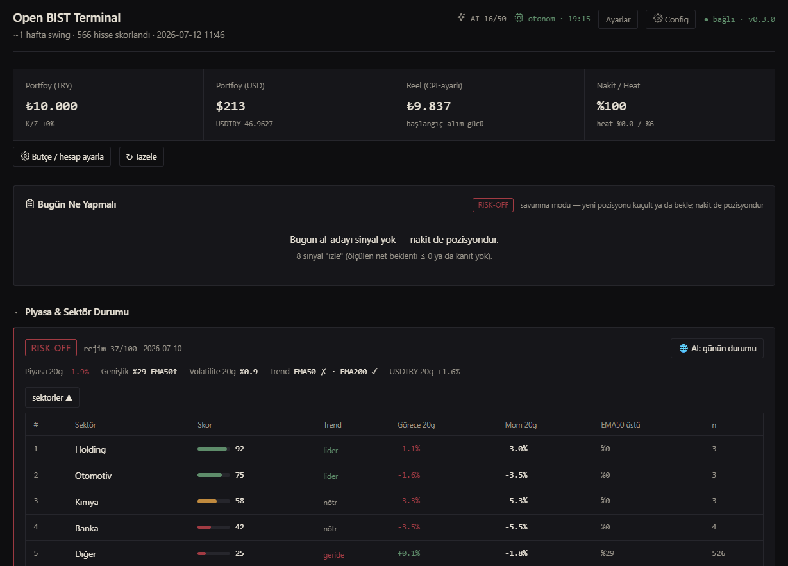
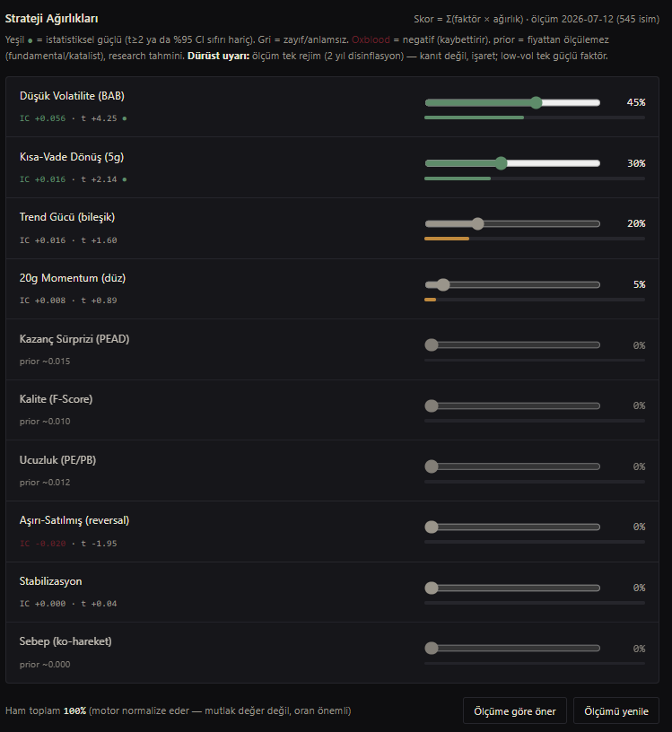
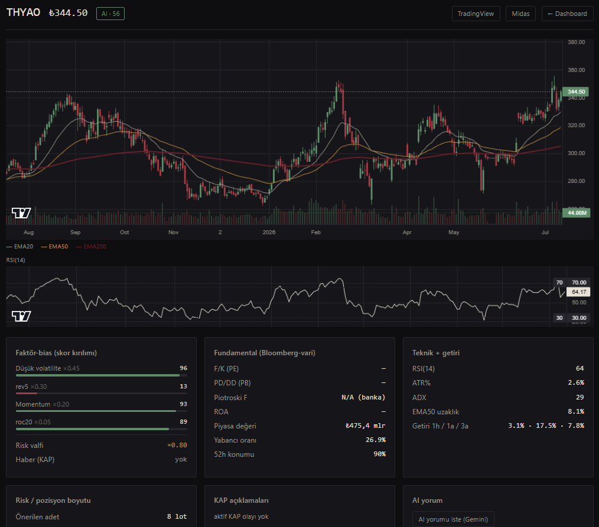

# Open BIST Terminal

Borsa İstanbul için açık kaynak, **dürüst** bir karar-destek terminali. Tüm BIST'i tarar,
skorlar, olay-tetikli setup'ları yakalar, KAP/haberi bir LLM ile yorumlar — ama **emir
göndermez**. Kararı sen verirsin.

[](LICENSE)


> *An open-source, honest decision-support terminal for the Turkish stock market (BIST).
> It scores, scans, and comments — it never trades. Local-first, no Docker. AGPL-3.0.*



## Bu ne?

Kısa versiyon: tüm BIST'i her gün tarayan, her hisseye 0–100 **fırsat skoru** veren,
olay-tetikli **setup**'ları yakalayan, KAP/haberi bir LLM ile **niteliksel** yorumlayan bir
dashboard. Backend Python (FastAPI + SQLite), frontend Next.js. **Docker yok, hesap yok, bulut
yok** — `git clone` yapıp çalıştırıyorsun, veri senin diskinde kalıyor.

Uzun versiyon — ve projenin **asıl olayı**: bunu yaparken kendime karşı dürüst olmaya çalıştım.
Piyasayı yenen sihirli bir formül bulmadım; kimse bulmadı. Literatürden denediğim 21 klasik
stratejinin 21'i işlem maliyetini geçince çöktü. Elimde kalan birkaç **zayıf ama ölçülmüş**
kenar var, ve sistem bunları abartmadan gösteriyor: skorun kendisi bir fiyat kâhini değil, bir
kalite/bağlam **filtresi**; gerçek kısa-vade kenar setup katmanında, o da "zayıf". Sistem bunu
her ekranda tekrar söylüyor, çünkü ilk kandırmak istemediğim kişi kendimdim.

Yani bu bir "zengin ol" botu değil. Disiplinli, ölçen, yalan söylemeyen bir alet.

## 60 saniyede çalıştır

Gereken: **Python 3.12+**, **Node 20+**. Docker/Postgres/Redis **yok**.

**Windows** — `start.bat`'a çift tıkla. **macOS / Linux:**

```bash
git clone https://github.com/<kullanıcı>/open-bist-terminal.git
cd open-bist-terminal
bash start.sh        # Windows: start.bat
```

İlk çalıştırma venv + bağımlılıkları kurar, SQLite'ı hazırlar, backend'i (`:8000`) ve
frontend'i (`:4000`) başlatır. Sonra tarayıcıda **http://localhost:4000**. Hepsi bu.

Veri boş gelir (BIST verisi telifli — repoya konmaz). İlk doldurma:

```bash
cd backend
.venv/bin/python scripts/fetch_history.py     # barları çek (birkaç dk; Windows: .venv\Scripts\python)
.venv/bin/python scripts/run_scoring.py       # skorla + tara
```

…ya da otonom modu aç, her akşam kendini doldursun (aşağıda).

## Ekranlar

**Ana panel** — "Bugün Ne Yapmalı" (öncelik-sıralı), setup kartları, faktör skorları:


**Ayarlar** — AI sağlayıcı (Gemini / OpenAI-uyumlu), risk profili, faktör ağırlıkları, tek kaydet-barı:



**Hisse detayı** — mum grafiği + indikatörler + fundamentaller + KAP/AI:



## Nasıl çalışıyor?

Üç katman, en dürüstten en spekülatife:

1. **Fırsat skoru (0–100).** Çok-faktör (düşük-vol, PEAD, value, momentum, reversal…),
   rank-IC ile kalibre. Ama net olalım: ölçümde istatistiksel-güçlü tek faktör **düşük
   volatilite**. Yani skor "yarın çıkar" demez; "bu isim sakin/kaliteli mi" der. Bir **filtre**,
   kâhin değil.

2. **Setup taraması.** Olay-tetikli (squeeze breakout, snapback, trend-pullback, PEAD-drift…).
   Her biri kendi verimizde event-study ile, **işlem maliyeti düşülerek** ölçülür. En iyi ikisi:
   Sıkışma Kırılımı (net PF ~1.42) ve Uzun Sıkışma (~1.56) — ikisi de "zayıf" (t<1.5, tek rejim).
   Gerçek kısa-vade kenar burada.

3. **AI katalist (opsiyonel).** KAP açıklamalarını ve haberi bir LLM *niteliksel* yorumlar
   (bedelli→negatif, geri-alım→pozitif, rutin→nötr). **Hiçbir sayı, skor ya da pozisyon boyutu
   AI'dan gelmez** — hepsi deterministik koddan. AI sadece kelimelerle konuşur.

Sinyal sıralaması = ölçülen net beklenti × sinyal gücü × bağlam × haber →
**AL-ADAYI / İZLE / GİRME** (İZLE = kenar kanıtlanmadı, GİRME = maliyet planı öldürüyor).

## Dürüst uyarı (lütfen oku)

- Bu **yatırım tavsiyesi değil**. Ben lisanslı danışman değilim; bu yazılım da değil.
- Ölçümler **tek rejim** (2023–2025 disinflasyon). Kanıt değil, **işaret**. Rejim dönerse kenarlar kaybolur.
- "Haftada +%10" **yapısal olarak imkânsız**. İyi bir hafta bir-iki puandır ve düzenli yanılır.
- Veri **günlük ve ~15 dk gecikmeli** — scalping/HFT aracı değil.
- **Emir göndermez.** Execution senin (ör. Midas'ta), manuel. Tüm risk sende.

## AI (opsiyonel)

AI olmadan sistem tüm skoru/setup'ı deterministik üretmeye devam eder. Katalist yorumu istersen
**Ayarlar → AI API Anahtarları** → sağlayıcı seç:

- **Gemini** (Google, ücretsiz katman yeter) — anahtar: <https://aistudio.google.com/apikey>
- **OpenAI-uyumlu** — OpenAI · DeepSeek · Groq · yerel (Ollama/LM Studio): base URL + model + anahtar.

Anahtarlar yerel `bist.db`'de saklanır (git'e girmez), **maskeli** gösterilir, **loglanmaz**.
`.env` gerekmez. Günlük çağrı tavanı `config → ai_budget.daily_cap` (free-tier koruması).

## Otonom mod

Backend açık kaldıkça sistem kendi döner (APScheduler, in-process; saatler Europe/Istanbul):

- **Gecelik** (Pzt-Cum 19:15): bar çek + skor + setup tara + F/SUE tazele.
- **KAP nabzı** (günde 3 kez: 11:00 / 14:00 / 17:00): yeni açıklama → AI yorum → yeniden skor.
  (Sıklık `config → scheduler.kap_poll_times` ile ayarlanır; AI kotasının bir dilimi akşam
  koşumuna rezervedir — `ai_budget.evening_reserve`.)
- **Haftalık** (Cmt): faktör kalibrasyonu + PE/PB sweep; 4 haftada bir event-study.

Durum header'daki otonom rozetinde. Kapatmak: `config → scheduler.enabled=false`. (PC piyasa
saatlerinde açık + uyku kapalı olmalı; scheduler in-process.)

## Repo düzeni

```
backend/          FastAPI + SQLAlchemy + APScheduler  (:8000)
  app/
    engine/       skorlama · indikatörler · F-Score · setup dedektörleri · öncelik
    backtest/     event-study · kalibrasyon · çıkış-study · rank-IC
    data/         yfinance / borsapy / isyatirim (fiyat · evren · fundamental · FX)
    news/         KAP çekme + LLM yorumu
    llm/          gemini_client (sağlayıcı router) + openai_client (OpenAI-uyumlu)
    risk/         sizing · portföy · profiller
  scripts/        fetch_history · run_scoring · poll_kap · run_event_study
  tests/          159 test
frontend/         Next.js 15 (App Router) — dashboard · settings · ticker · config
docs/             skor & setup metodolojisi (v0.2)
start.sh/.bat     tek komut başlatıcı (venv + DB + backend + frontend)
```

Detay: skor matematiği [`docs/BIST-SCORING-v0.2.md`](docs/BIST-SCORING-v0.2.md),
setup'lar [`docs/BIST-SETUPS-v0.1.md`](docs/BIST-SETUPS-v0.1.md).

## Lisans & katkı

**[AGPL-3.0](LICENSE).** Bunu bir servis olarak sunarsan kaynağı da açman gerekir — kasıtlı
seçim: iyileştirmeler toplulukta kalsın. Katkılar (issue/PR) memnuniyetle; yeni bir
strateji/faktör önerirsen **ön-kayıtlı ölçüm** (parametre fishing yok, OOS teyidi) beklenir —
proje disiplini bu.

---

<sub>BIST verisi yeniden yayınlanamaz (Foreks/BIST telifi); veri dosyaları `.gitignore`'da.
Skor kısa-vade tahmin değil, low-vol kalite/bağlam filtresidir — asıl kenar setup katmanında ve
o da mütevazı. Yatırım tavsiyesi değildir.</sub>
